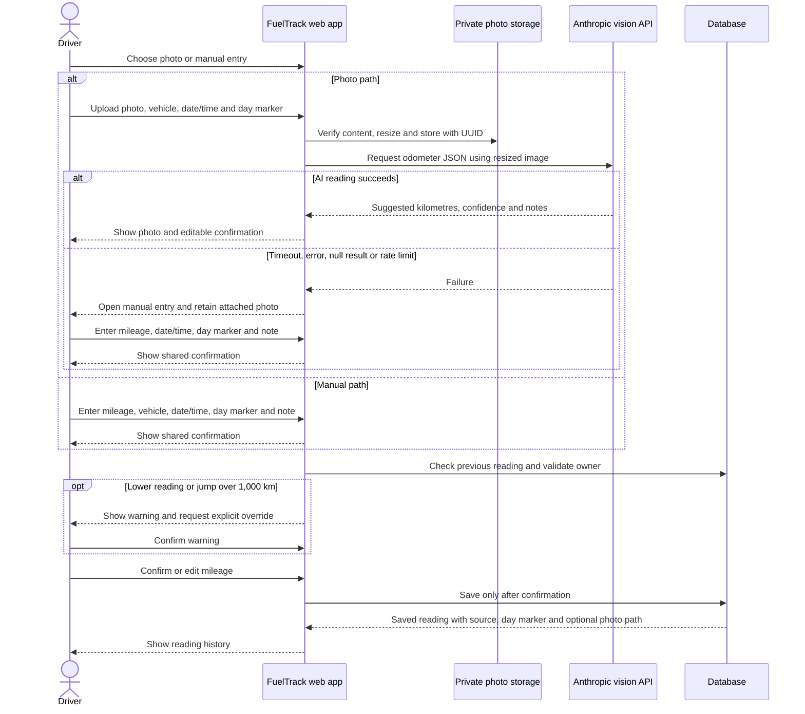

# Reading entry sequence

```mermaid
sequenceDiagram
    actor Driver
    participant Web as FuelTrack web app
    participant Storage as Private photo storage
    participant AI as Anthropic vision API
    participant DB as Database

    Driver->>Web: Choose photo or manual entry
    alt Photo path
        Driver->>Web: Upload photo, vehicle, date/time and day marker
        Web->>Storage: Verify content, resize and store with UUID
        Web->>AI: Request odometer JSON using resized image
        alt AI reading succeeds
            AI-->>Web: Suggested kilometres, confidence and notes
            Web-->>Driver: Show photo and editable confirmation
        else Timeout, error, null result or rate limit
            AI-->>Web: Failure
            Web-->>Driver: Open manual entry and retain attached photo
            Driver->>Web: Enter mileage, date/time, day marker and note
            Web-->>Driver: Show shared confirmation
        end
    else Manual path
        Driver->>Web: Enter mileage, vehicle, date/time, day marker and note
        Web-->>Driver: Show shared confirmation
    end
    Web->>DB: Check previous reading and validate owner
    opt Lower reading or jump over 1,000 km
        Web-->>Driver: Show warning and request explicit override
        Driver->>Web: Confirm warning
    end
    Driver->>Web: Confirm or edit mileage
    Web->>DB: Save only after confirmation
    DB-->>Web: Saved reading with source, day marker and optional photo path
    Web-->>Driver: Show reading history
```
